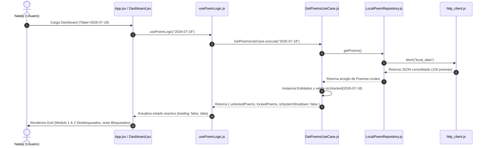

# Documento de Arquitectura de Software
# Proyecto: 100 Poemas para Nataly
# Autor: Agente 2 (Staff Software Architect)
# Estado: APROBADO

Este documento define las decisiones de diseño arquitectónico, patrones y flujo de control para la aplicación "100 Poemas para Nataly". Se ha estructurado bajo los principios de **Vertical Slicing (Rebanado Vertical)** y la separación clara de responsabilidades en las capas de Dominio, Aplicación e Infraestructura.

---

## 1. Resumen Ejecutivo
El objetivo de este diseño es proveer una plataforma elegante, minimalista y de altísima fidelidad visual para la entrega progresiva de 100 poemas a Nataly. La lógica clave es el control de desbloqueo temporal por fechas. Para garantizar la consistencia, mantenimiento y desacoplamiento, aplicamos principios de Clean Architecture agrupando la lógica por funcionalidad de negocio (Features) en lugar de capas técnicas globales.

---

## 2. Diagrama de Componentes (Mermaid)

El siguiente diagrama ilustra la interacción entre el núcleo compartido del sistema (`src/core/`) y la rebanada vertical autónoma de poemas (`src/features/poems/`):

```mermaid
graph TD
    %% Estilo de componentes
    classDef core fill:#1e1e2e,stroke:#cba6f7,stroke-width:2px,color:#cdd6f4;
    classDef feature fill:#11111b,stroke:#89b4fa,stroke-width:2px,color:#cdd6f4;
    classDef external fill:#313244,stroke:#f38ba8,stroke-width:1px,color:#cdd6f4;

    %% Elementos Core
    subgraph Core ["Núcleo Compartido (src/core/)"]
        HttpClient["http/http_client.js<br/>(Cliente HTTP Nativo Fetch)"]:::core
        Config["config/env.js<br/>(Variables de Entorno)"]:::core
        Errors["errors/errors.js<br/>(Gestión de Excepciones)"]:::core
    end

    %% Elementos de la Feature Poems
    subgraph PoemsFeature ["Feature Poemas (src/features/poems/)"]
        subgraph DomainLayer ["Capa de Dominio"]
            PoemEntity["domain/Poem.js<br/>(Entidad de Negocio)"]:::feature
            RepoContract["domain/PoemRepository.js<br/>(Contrato del Repositorio)"]:::feature
        end

        subgraph ApplicationLayer ["Capa de Aplicación"]
            GetPoemsUseCase["application/GetPoemsUseCase.js<br/>(Caso de Uso: Filtrar/Validar)"]:::feature
        end

        subgraph InfrastructureLayer ["Capa de Infraestructura"]
            LocalRepo["infrastructure/repositories/LocalPoemRepository.js"]:::feature
            JsonData["infrastructure/data/poems_data.json<br/>(Datos consolidados 1-100)"]:::feature
            UsePoemLogic["infrastructure/hooks/usePoemLogic.js<br/>(React Hook de Negocio)"]:::feature
            
            subgraph Presentation ["Vistas y Componentes"]
                AppLayout["App.jsx / Index.css<br/>(Layout y Estilos CSS Globales)"]:::feature
                LandingPage["infrastructure/pages/Landing.jsx<br/>(Pantalla de Entrada)"]:::feature
                DashboardPage["infrastructure/pages/Dashboard.jsx<br/>(Grid de Poemas)"]:::feature
                PoemCard["infrastructure/components/PoemCard.jsx<br/>(Tarjeta Individual)"]:::feature
                FinalScreen["infrastructure/components/FinalScreen.jsx<br/>(Cierre 2 de Agosto)"]:::feature
            end
        end
    end

    %% Relaciones
    UsePoemLogic --> GetPoemsUseCase
    GetPoemsUseCase --> RepoContract
    LocalRepo -- Implementa --> RepoContract
    LocalRepo --> HttpClient
    LocalRepo --> JsonData
    PoemEntity <-- Utilizada por -- GetPoemsUseCase
    
    %% Interacciones de Vista
    DashboardPage --> PoemCard
    DashboardPage --> UsePoemLogic
    AppLayout --> LandingPage
    AppLayout --> DashboardPage
    AppLayout --> FinalScreen
```

### Diagrama de Secuencia de Carga y Simulación de Fechas



---

## 3. Registro de Decisiones de Arquitectura (ADR)

### ADR 001: Arquitectura de Rebanado Vertical (Vertical Slicing)
*   **Contexto:** Los desarrollos tradicionales separan el código por capas técnicas horizontales (`controllers/`, `views/`, `models/`). Esto genera alto acoplamiento cuando se modifica una característica de negocio, pues requiere navegar por múltiples carpetas.
*   **Decisión:** Agrupar el código en torno a características funcionales de negocio (features). El módulo `poems` encapsula su propio dominio, lógica de aplicación e infraestructura.
*   **Consecuencias:**
    *   *Positivo:* Alta cohesión. Si se elimina o modifica el módulo de poemas, el núcleo del sistema no se ve afectado.
    *   *Negativo:* Requiere disciplina mental para no importar archivos de infraestructura de otras features de forma desordenada.

### ADR 002: Patrón Repositorio y Desacoplamiento de Datos
*   **Contexto:** La aplicación utilizará datos locales consolidados desde un archivo JSON. Sin embargo, acoplar la UI directamente a la importación del archivo JSON impedirá migrar a una base de datos física en el futuro.
*   **Decisión:** Definir una interfaz `PoemRepository` en la capa de dominio y crear un adaptador `LocalPoemRepository` en la infraestructura que lee el JSON simulando una llamada de red asíncrona mediante el cliente de red nativo.
*   **Consecuencias:**
    *   *Positivo:* Para cambiar el almacenamiento a una API REST remota o base de datos en la nube, solo se requiere crear un `RemotePoemRepository` e inyectarlo. Cero cambios en la UI o en los casos de uso.
    *   *Negativo:* Incrementa ligeramente el número de archivos iniciales (boilerplate), el cual se compensa con el valor de mantenibilidad.

### ADR 003: Simulación de Fechas por Query Parameters
*   **Contexto:** El sistema de desbloqueo depende estrictamente del tiempo. Probar las fases del 14 de julio al 2 de agosto del 2026 requiere poder cambiar la hora y fecha del sistema de forma ágil y no destructiva.
*   **Decisión:** Inyectar la fecha de comparación del sistema desde los parámetros de búsqueda de la URL (`?date=YYYY-MM-DD`). Si no está presente, se tomará por defecto la fecha actual del sistema.
*   **Consecuencias:**
    *   *Positivo:* Facilita las pruebas de QA al permitir cambiar el estado de la aplicación instantáneamente refrescando la página. No afecta la base de datos ni interfiere visualmente con el diseño final de la interfaz.
